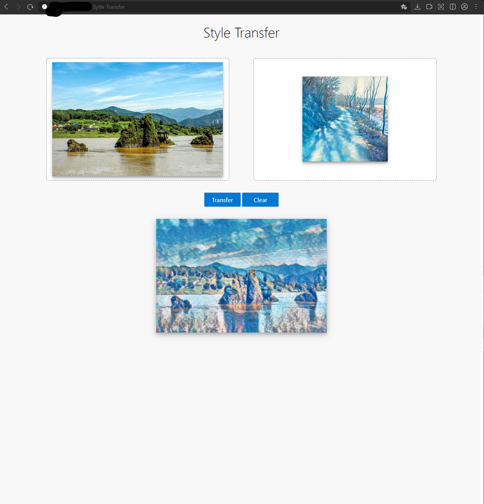

# Style Transfer Web
Style transfer application using flask and TF Hub


## Running locally

1. Clone this repository

```bash
git clone https://github.com/jjerry-k/stylet_transfer_web.git
```
2. Create and Activate virtual environment
```bash
python3 -m venv env 
source env/bin/activate
```

3. Install dependencies
```bash
pip install --upgrade pip
pip install -r requirements
```

4. Install Tensorflow dependencies
- On Windows & Linux & MacOS
```bash
pip install tensorflow tflite_runtime
```

- On Raspberry PI
  - Install tflite_runtime using whl [[link]](https://google-coral.github.io/py-repo/tflite-runtime/)
  - Install tensorflow using whl [[link]](https://github.com/Qengineering/TensorFlow-Raspberry-Pi_64-bit)
```bash
# Download each .whl 
pip install {tensorflow wheel file}
pip install {tflite_runtime wheel file}
```

5. Run flask
``` bash
# Production
gunicorn -b 0.0.0.0:{Port Number} app:app

# Deploy
gunicorn -b 0.0.0.0:{Port Number} app:app -D
```


### Reference
- https://www.tensorflow.org/hub/tutorials/tf2_arbitrary_image_stylization